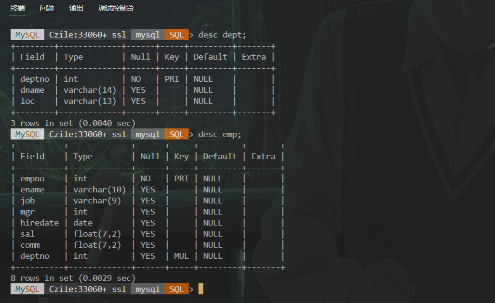

# 数据库第11周作业
`19336035` `陈梓乐`

---
[TOC]
---
## 1. 安装 `mysql`
```bash
winget install oracle.mysql
```


## 2. 安装 `postgresql`

```bash
winget install postgresql.postgresql -l 'D:\program files\'
```


## 3. 将 `emp`、`dept` 表导入 `mysql`

@import "../src/import2mysql.sql"


## 4. 将 `emp`、`dept` 表导入 `PGSQL`
@import "../src/import2pgsql.sql"


## 5. 找出 `Oracle` 与 `MySQL`，`PostgreSQL` 的 SQL 实现语法不同之处，每个数据库各找 5 种差异

|Oracle 与 Mysql/PgSql 差异之处||
|:-:|-|
|选择工资前三的员工信息|
|Oracle|<tt>select * from (<br>&emsp; select * from emp order by sal desc<br>) where rownum <= 3;</tt>|
|MySql|<tt>select * from emp order by sal desc limit 3;</tt>|
|PgSql|<tt>select * from emp order by sal desc limit 3;|
|选出员工工资中位数|
|Oracle|<tt>select median(sal) from emp;|
|MySql|<tt>with Numbered as (<br>&emsp; select \*, count(*) over () as Cnt,<br>&emsp; ROW_NUMBER() over (order by sal) as RowNum <br>&emsp; FROM emp<br>) select avg(sal) from Numbered <br>&emsp;where RowNum in ((Cnt+1)/2, (Cnt+2)/2);`|
|PgSql|<tt>select percentile_disc(0.5) <br>within group (order by sal) <br>from emp;|
|查看唯一行标识符|
|Oracle|<tt>select rowid from emp;|
|MySql|<tt>select _rowid from emp;|
|PgSql|<tt>select ctid from emp;</tt> <i>（ctid 将随着update而改变）</i>|
|首字母大写，其他字母小写|
|Oracle|<tt>select initcap(lower('HELLO')) from dual;|
|MySql|<tt>select concat(UPPER(left("HELLO",1)), <br>&emsp;&emsp;&emsp;&ensp;substring(lower('HELLO'), 2, (length('HELLO') - 1))) <br>from dual;`|
|PgSql|<tt>select initcap(lower('HELLO'));|
|查看当前登录用户|
|Oracle|<tt>select user from dual;|
|MySql|<tt>select user();|
|PgSql|<tt>select user;|

