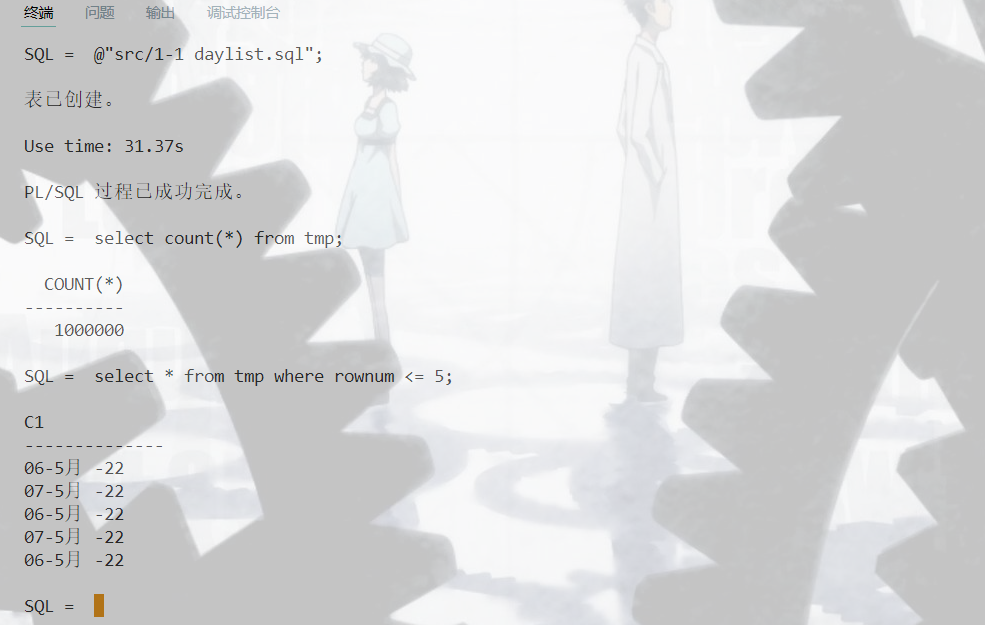
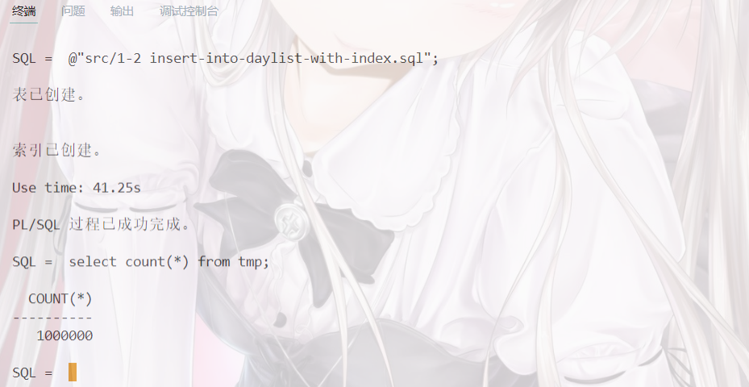
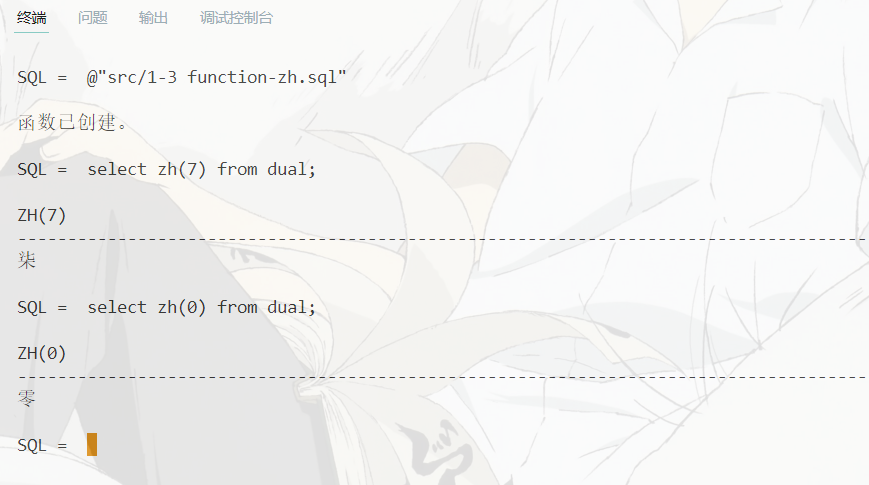
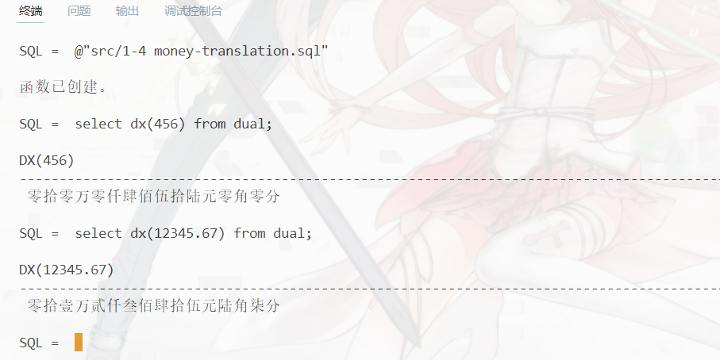

# 数据库第12周作业
`19336035` `陈梓乐`

---
1. 用 PL/SQL 的 `for` ，`while` 等循环语句，建立一张 $100$ 万行的 `table`（先创建，里面只需要包含一个日期型列 `c1` ），其中奇数行插入 `sysdate` ，偶数行插入 `sysdate+1`.
2. 计算在 1 中输出所花的时间，要求不使用 `sqlplus` 的 `timing`，用 `PL/SQL` 来实现（提示，`PL/SQL` 在屏幕输出内容比较复杂，设置 `sqlplus` 环境变量 `serveroutput` 为 `on`，用 `dbms_output` 包的 `enable` 存储过程打开输出，在使用该包中的 `put_line` 函数完成输出）

@import "../src/1-1 daylist.sql"


3. 用 `create index xxx on <表名> (列名)` 在 1-2 中的表里建立索引，再插入 100 万行，比较一下插入所需要的时间变化



4. 阅读“存储过程”和“存储函数”部分，你觉得使用存储过程和存储函数来建立代码能带来什么好处？

- 允许模块化设计和多人协作
- 允许代码复用
- 便于维护和发布

5. 实现存储函数 zh，能把输入的一位阿拉伯数字转成中文大写。

**惟需注意，sql脚本须以gbk格式保存**。
```sql
create or replace function zh (x in number)
return varchar2 is
    cn varchar2(2);
Begin
    cn := translate(
        to_char(mod(x, 10)), 
        '1234567890', 
        '壹贰叁肆伍陆柒捌玖零'
    );
    return cn;
End;
/
```


6. 实现存储函数 dx，能把阿拉伯数字的金额（最大到十万位）转化为中文大写金额.
```sql
create or replace function dx(x in float)
return varchar2 is
    cn varchar2(50);
Begin
    cn := translate(
        to_char(x, '099990.99'),
        '1234567890.', 
        '壹贰叁肆伍陆柒捌玖零元'
    );
    cn := translate(
        '01拾2万3仟4佰5拾678角9分',
        '0123456789',
        cn
    );
    return cn;
End;
/
```
