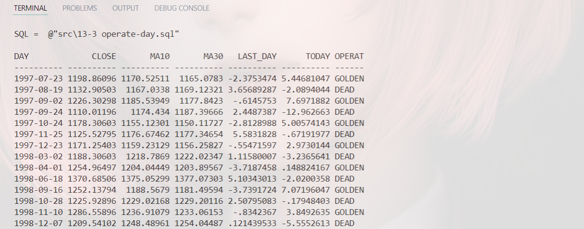
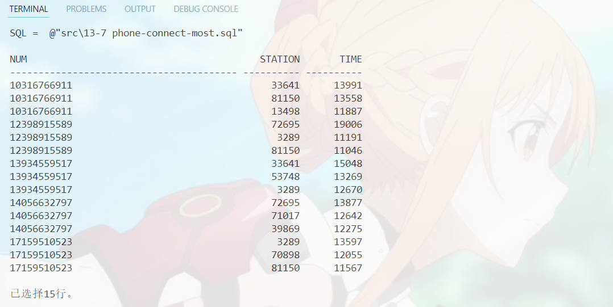

# 数据库第13周作业
`19336035` `陈梓乐`

---
1. **学习游标的使用（cursor，参考《Introduction to PL/SQL》一书第 6 章），利用游标实现“查询公司中工资最高的三位员工”**

@import "../src/13-1 most-sal.sql"

2. **把“课程资源”中的“上证指数历史数据”导入到 Oracle，完成以下任务（尽量使用 1 条 SQL语句完成）**
- **参考课程幻灯片第 48 页，求出所有“黄金交叉”（日期）和“死亡交叉”**
- **参考课程幻灯片第 51 页，找出所有“连升三天”“连跌三天”的日期**

<u>导入数据</u>
- 创建表格：
@import "../src/13-2 stock-table-create.sql"

- 导入数据
@import "../src/load-stock.ctl"

- 展示导入效果

<u>找出黄金交叉与死亡交叉日期</u>
@import "../src/13-3 operate-day.sql"

共210行，其中有105行是黄金交叉点。

<u>找出连续涨跌三天的日子</u>
@import "../src/13-4 continual-rise-or-fall.sql"

共1501行，其中连续涨3天的日子有864天。

3. **参考课程幻灯片第 68 页。**
- **先随机生成模拟数据，包含手机号，时间戳（只需要考虑在同天内即可），基站 id，每一行数据表示手机定期与最接近的基站联系了一次**
- **假设某个特定号码沿着时间轴联系了 A 站，接着再联系 B 站（也可能是再次联系 A），那么他在 A 的停留时间就是前后两个时间戳之差。求每个号码当天连接时间最长的三个基站**

<u>建立表格</u>
@import "../src/13-5 phone-connect-data-import.sql"
<u>导入数据</u>
设有5个手机号，共10个基站，产生300条连接记录，导入代码如下：
@import "..\src\13-1 phone-connect-data-import.py"

<u>处理数据</u>
@import "..\src\13-6 phone-connect-analysis.sql"

<u>找出连接时间前三的基站</u>
@import "../src\13-7 phone-connect-most.sql"
