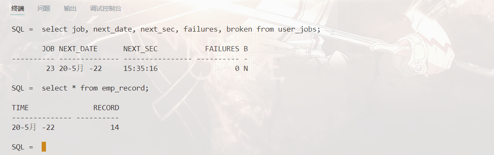
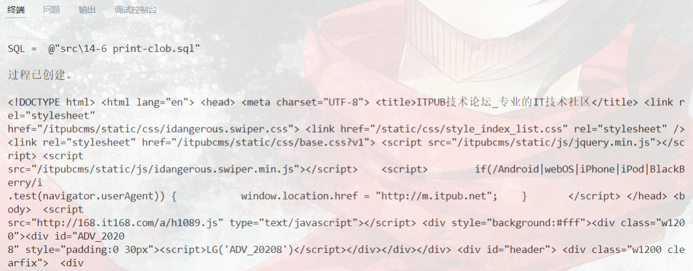
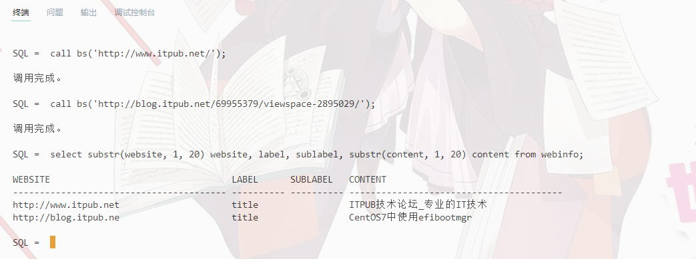

# 数据库第14次作业
`19336035` `陈梓乐`

1. 利用内置包 `DBMS_JOB` 建立定时任务，每 5 分钟在特定表中插入一条记录，内容为 `emp` 表的行数以及时间戳。

<u> 创建记录表 </u>

```sql
create table emp_record (
    time date,
    record number(10)
);
```

<u> 创建记录过程 </u>

```sql
create or replace procedure emprec is
begin
    insert into emp_record values(
        sysdate, 
        (select count(*) from emp)
    );
    commit;
end;
/
```

<u> 创建定时任务 </u>
@import "../src/14-1 jobrec.sql"


2. 批量创建 99 个用户 A01-A99，口令均为 tiger，在这 99 位用户下都建立 emp 表并且把 scott 的 emp 表内容复制过去。

<u>基本想法</u>
利用 PL/SQL 的循环重复下列语句：


<u>代码</u>

@import "../src/14-2 user-create.sql"

<u>查看效果</u>


3. 利用 `UTL_FILE` 包（而不是 `sqlldr` ）把“上证指数历史数据”中的股票交易信息导入到 Oracle 的指定表中

<u>创建表</u>

@import "..\src\13-2 stock-table-create.sql"

<u>创建目录变量</u>
```sql
create or replace directory data as 'data';
```

<u>导入数据</u>
@import "../src\14-3 import-stock.sql"

<u>效果展示</u>


4. 利用 `UTL_HTTP` 包抓取 [`ITPUB` 网站](http://www.itpub.net)的首页和所有次级页面，*注意不抓外链，不重复抓取，把结果记录在一张表中，包含链接，网页全文，以及从网页中提取的一些信息，例如标题等*（可能需要用 `Oracle` 的正则表达式函数族 `regex_xxxx`）

<u>修改控制访问列表</u>
将[ITPUB](ITPUB.NET)加入到控制访问列表中，并授予 scott 访问的权限。这只需要在 `sys` 用户下运行如下代码：

@import "../src\14-5 acl.sql"

<u>爬取网站信息</u>

由于信息较长，我们使用 `clob` 的数据类型并分块输出。创建一个函数用于爬取网站信息，在 `scott` 下代码如下：

@import "../src\14-4 itpub-info.sql"

<u>阶段性效果展示</u>
将存放于 `clob` 中的数据取出并去除重复的空格和换行，效果如下：
@import "..\src\14-6 print-clob.sql"


<u>筛选有用信息</u>
先建立一张表格，用来记录网站的有用信息，表格结构如下：

```sql
create table webinfo (
    website varchar2(500),
    label varchar2(10),
    sublabel varchar2(10),
    content varchar2(500)
);
```

为了方便，我们只捕获网站中标签为 `title` 的内容，执行过程如下：

@import "../src\14-7 get-info.sql"

效果如下：



<u>找出网站所有二级链接</u>

使用找 `title` 的经验，找出所有标签为 `a` 的链接以及描述，并对这些链接爬取源代码分析出其 `title`。

@import "../src\14-8 get-href.sql"

效果如下：


<u>综合上述代码</u>
@import "../src\14-9 final-q4.sql"


<u>筛选</u>

*找出前30个二级链接*


5. 写一个触发器，使 emp 表只有在周一到周五 8:00-18:00 这个时间段才可以被修改
@import "../src\14-10 trigger.sql"