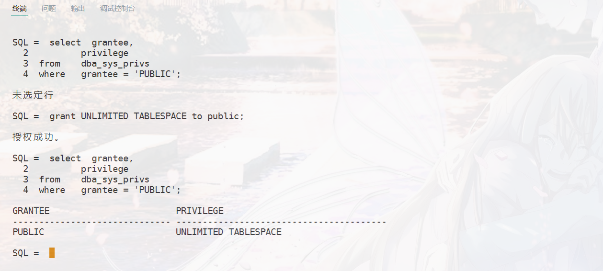
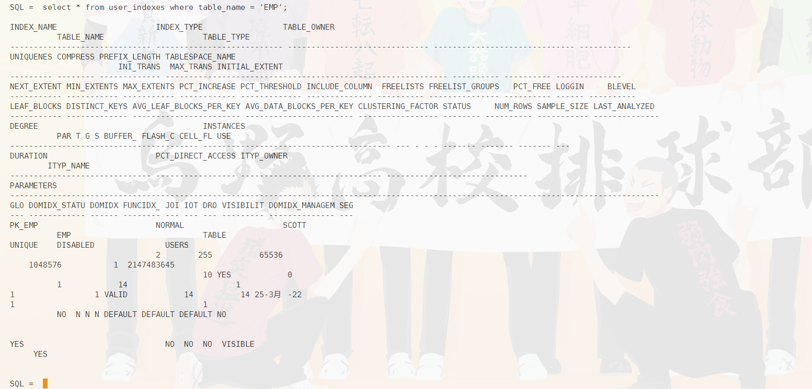
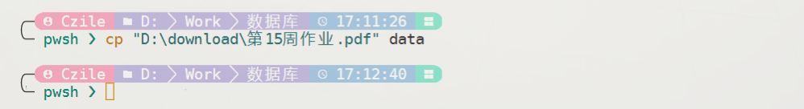

# 数据库第十五周作业 
`19336035` `陈梓乐`

1. **建一个有外键和值约束的表（例如之前的 SC 表），再通过数据字典视图查出这些约束的信息.**
```sql
select  substr(owner, 1, 5) owner,
        substr(constraint_name, 1, 12) constraint_name,
        constraint_type, 
        substr(r_owner, 1, 5) r_owner,
        substr(r_constraint_name,1, 12) r_constraint_name
from    user_constraints
where   table_name = 'SCORE';
```


2. **查询 emp 表上的所有触发器及其对应代码**
```sql
select  substr(trigger_name,1, 10),
        substr(trigger_type,1, 30),
        trigger_body
from    user_triggers
where   table_name = 'EMP';
```


3. **查看当前 public 用户有哪些系统特权和角色？**

`sys` 下：
```sql
select  grantee,
        privilege 
from    dba_sys_privs
where   grantee = 'PUBLIC';
```



4. **查询 emp 表上索引的信息**

```sql
select * from user_indexes where table_name = 'EMP';
```



5. **有些数据字典视图称为“动态性能视图”，记录系统物理底层信息，以 V$开头，统计下总共有多少个这样的视图**

`sys` 下：
```SQL
select count(*) from dba_views where view_name like 'V$%';
```


2. **用实验比较一下 with admin option 和 with grant option 在操作逻辑上的区别？**

- with admin option 只能在赋予 system privilege 的时使用
- with grant option 只能在赋予 object privilege 的时使用
- **撤消带有admin option 的system privileges 时，连带的权限将保留**
>例如：
>1. DBA 给了CREATE TABLE 系统权限给JEFF WITH ADMIN OPTION
>2. JEFF CREATES TABLE
>3. JEFF grants the CREATE TABLE 系统权限给EMI
>4. EMI CREATES A table
>5. DBA 撤消CREATE TABLE 系统权限从JEFF
结果：
**JEFF‘S TABLE 依然存在，但不能创建新的TABLE 了
EMI’S TABLE 依然存在，他还保留着CREATE TABLE 系统权限。**
- **撤消带有grant option 的object privileges 时，连带的权限也将撤消**
>例如：
>1. JEFF 给了SELECT object privileges 在EMP 上 WITH GRANT OPTION
>2. JEFF 给了SELECT 权限在EMP 上 TO EMI
>3. 后来，撤消JEFF的SELECT 权限
**结果：
EMI 的权限也被撤消了**

3. **阅读《Introduction to PL/SQL》第 15 章，试使用适当的 LOB 字段，将一个 pdf 文件写入到 Oracle 数据库的表中储存，然后完成反向操作，把保存了 pdf 文件的字段内容还原为原文件**

将第15周作业列表置于 `data` 文件夹下并更名为 `15.pdf`，我们将以该文件为例展示二进制数据的读写。

<u>读入数据并保存到数据库中</u>



先来创建记录数据的表格：
```sql
create table filedata (
    fname   varchar2(100),
    data    blob
);
```

然后创建 `data` 目录，并执行如下代码：
@import "../src\15-1 read-file.sql"

效果如下：


<u>取出数据并保存到文件中</u>

@import "../src\15-2 write-file.sql"

下图将说明以上代码可以实现将数据库中的数据保存到文件：

