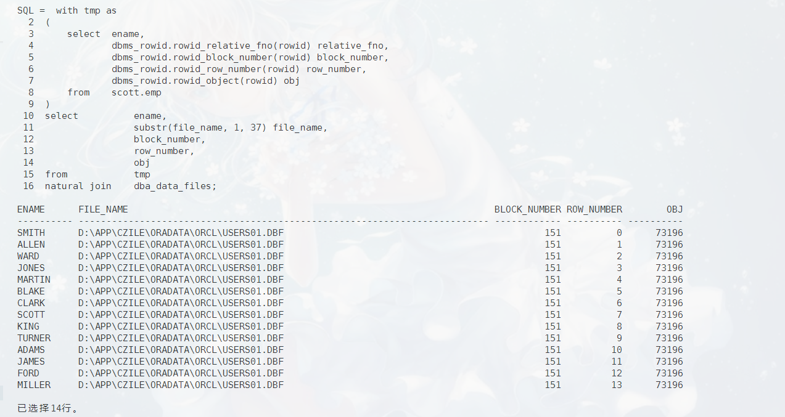

# 数据库第16周作业 附加作业
`19336035` `陈梓乐`

**参考 DSI 401 中第 4 章第 16 页的方法，dump 出 emp 表 KING 行所在的 block，并对 block内容做一定的剖析。提示：注意 user_dump_dest 初始化参数的值指向 trace 文件所在目录**

<u> 查询 KING 行所在的 block </u>
```sql
with tmp as
(
    select  ename,
            dbms_rowid.rowid_relative_fno(rowid) relative_fno,
            dbms_rowid.rowid_block_number(rowid) block_number,
            dbms_rowid.rowid_row_number(rowid) row_number,
            dbms_rowid.rowid_object(rowid) obj
    from    scott.emp
)
select          ename,
                substr(file_name, 1, 37) file_name,
                block_number,
                row_number,
                obj
from            tmp
natural join    dba_data_files;
```


可以看到，KING 所在的 block 是数据文件 `D:\APP\CZILE\ORADATA\ORCL\USERS01.DBF` 中的第 151 个 block。现在我们来 dump：

```sql
ALTER   SYSTEM 
DUMP    DATAFILE 'D:\APP\CZILE\ORADATA\ORCL\USERS01.DBF'
BLOCK   151;
```

接下来我们来查看 dump 出的文件，对应路径在:：
```sql
show parameter user_dump_dest;
```


对目录中文件按时间排序，最新文件截图如下：


<u>对文件内容进行分析</u>
1. 基础信息部分：
@import "../data/orcl_ora_21116.trc" {line_end=32 .line-numbers}

这里介绍了导出的环境，CPU，空间等等，方便调试。部分关键词释义如下：
|名称|释义|
|-|-|
tsn |data block所在表空间序号
file# | data block所在数据文件序号
minblk |dump的开始块号
maxblk |dump的终止块号
rdba |数据块地址(rfile#+block#)
scn |scn号
seq | 序列号
flg |0x01(新建块) 0x2(数据块延迟清洗推进scn和seq) 0X04(设置校验和) 0x08(临时块)
tail | 保持一致性 lower scn + type + seq
frmt | oracle8以上为2, 0x01(v7) / 0x02(v8)
chkval | 可选择的校验值
type | block的类型, 0x06(表/索引块)

2. 二进制部分

该部分介绍了对应表中的二进制原文，左边是二进制所对应的十六进制，右边是若对应可读文字则显示，部分内容如下：
@import "../data/orcl_ora_21116.trc" {.line-numbers, line_begin=33, line_end=53}

3. 用户数据头

@import "../data/orcl_ora_21116.trc" {.line-numbers, line_begin=211, line_end=231}
这部分数据是用户数据总览，部分参数释义如下：
|名称|释义|
|-|-|
bdba | 0x01000097 --数据块的地址：16进制转成2进制取前10位二进制为文件号，后面剩于的部分表示块号，0X97转成10进制为151号块
tsiz | 0x1f98 --top of size块的总大小即8088个字节
hsiz | 0x2e --Data header size数据头大小
pbl | 0x1de45e64 --Pointer to buffer holding the block76543210
flag| N=pcrfree hit(clusters); F=do not put on free list; K=flushable cluster keys
ntab|表数：表示这个块的数据在一个表(如果是聚簇表就有可能是2或2以上)
nrow|行数：表示这个表有14行数据
frre| The first free row entry in the row directory＝you have to add one
fsbo | Free space begin offset 叫起始空间：可以存放数据空间的起始位置(即定义了数据层中空闲空间的起始offset)
fseo | Free space end offset 叫结束空间：可以存放数据空间的结束位置(即定义了数据层中空闲空间的结束offset)
avsp|Available space for new entries 叫空闲空间：定义了数据层中空闲空间的字节数
tosp|Total space 叫最终空闲空间：定义了ITL中事务提交后，数据层中空闲空间的字节数

接下去的行是每一行的起始位置和终止位置

4. 用户数据
@import "../data/orcl_ora_21116.trc" {.line-numbers, line_begin=239, line_end=249}
这就是第一行的dump信息，对应的是每一列的编码，请参照第四题，不再赘述。