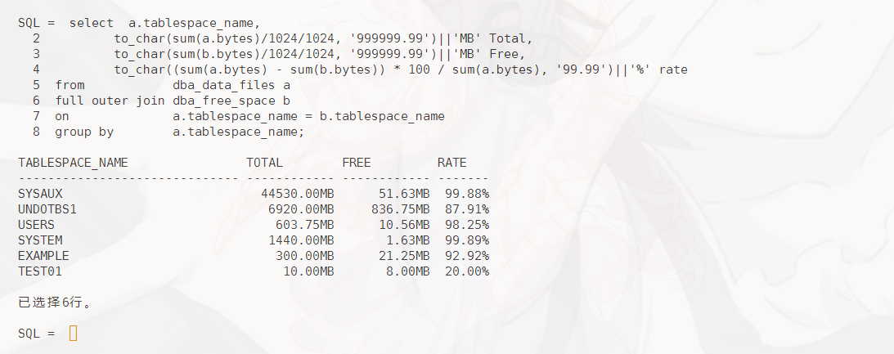
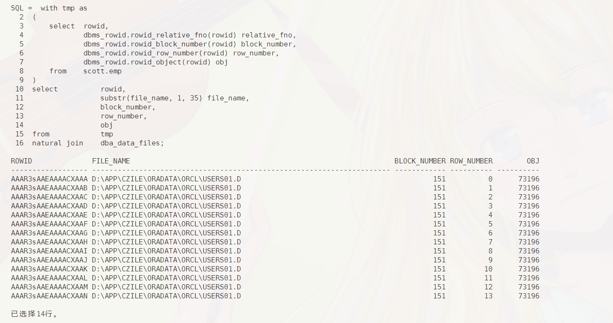
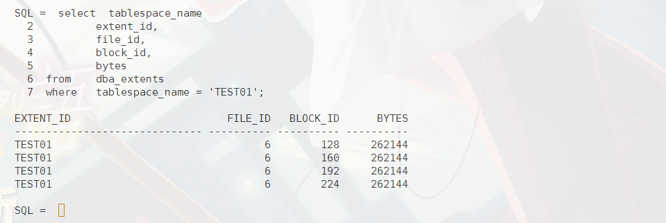
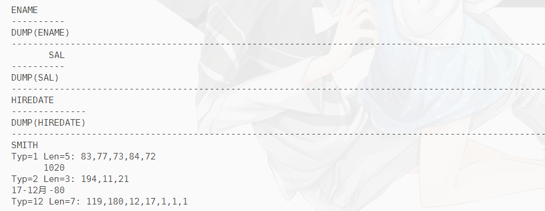
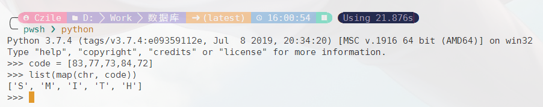

# 数据库第16周作业
`19336035` `陈梓乐`

1. **求各表空间的容量（注意一个表空间对应多个数据文件的情况），剩余空间和使用率，要求一条 SQL 语句完成**
```sql
select  a.tablespace_name, 
        to_char(sum(a.bytes)/1024/1024, '999999.99')||'MB' Total,
        to_char(sum(b.bytes)/1024/1024, '999999.99')||'MB' Free,
        to_char((sum(a.bytes) - sum(b.bytes)) * 100 / sum(a.bytes), '99.99')||'%' rate
from            dba_data_files a
full outer join dba_free_space b
on              a.tablespace_name = b.tablespace_name
group by        a.tablespace_name;
```


2. **查出 emp 表中每一行的 rowid，并查出它们分别在哪个数据文件，第几个 block，第几个slot（row number），属于哪个对象？提示：利用 dbms_rowid 包，用法可以参考课程资源中的 DSI401 第 4 章有关内容，或《PL/SQL packages》**

```sql
with tmp as
(
    select  rowid,
            dbms_rowid.rowid_relative_fno(rowid) relative_fno,
            dbms_rowid.rowid_block_number(rowid) block_number,
            dbms_rowid.rowid_row_number(rowid) row_number,
            dbms_rowid.rowid_object(rowid) obj
    from    scott.emp
)
select          rowid,
                substr(file_name, 1, 37) file_name,
                block_number,
                row_number,
                obj
from            tmp
natural join    dba_data_files;
```



3. **分别创建本地管理和字典管理的表空间（给它适当的缺省 storage 参数），分别在上面建表，并且指出这些表的 storage 参数。通过 minextents 参数或 insert 行使这些表大小增长到一定规模。再通过观察 dba_extents 数据字典视图看下实际分配的 extent 情况，与你设计的storage 参数是否相符？**

<u>本地管理</u>
首先，我们创建一个本地管理的表空间，不妨名称设置为 `test01`：
```sql
create tablespace test01
    datafile 'D:/app/czile/oradata/orcl/test01.dbf' size 10M
    extent management local uniform size 256k;
```

接着，我们在表空间创建一个至少 1000kb 的表（因此 storage 参数当然是 `initial 1000k next 1000k`）：
```sql
create table test01t(x number)
    tablespace test01
    storage (initial 1000k next 1000k);
```

然后我们来看看表参数：
```sql
select  table_name, 
        initial_extent, 
        next_extent
from    user_tables
where   table_name = 'TEST01T';
```


接着，我们来查看对应的 extent：
```sql
select  tablespace_name
        extent_id,
        file_id,
        block_id,
        bytes
from    dba_extents
where   tablespace_name = 'TEST01';
```


可以看到 oracle 创建了4个 `extent` ，每个 `extent` 大小是 `uniform size`，但为了储存 `test01t`，事实上，最后一个 `extent` 只需要 237568 个字节的空间即可，然而 oracle 的 `extent` 仍然以 `uniform size` 创建 `extent`。因此总结：本地管理的表空间的 `extent` 以 `uniform size` 扩展，直到第一次能放下全部数据。

<u> 字典管理 </u>
我们先来创建字典管理的表空间，不妨称为 `test02`：
```sql
create tablespace test02
    datafile 'D:/app/czile/oradata/orcl/test02.dbf' size 10M
    extent management dictionary 
    default storage (initial 256k next 512k);
```


发现无法创建字典管理的表空间，查找相关 oracle 文档知要创建字典管理的表空间，需要 `system` 表空间是字典管理的，这需要在安装开始时选定，故无法对比。

>Ref:
ORA-12913: 无法创建字典管理的表空间 https://blog.csdn.net/OsbornHuo/article/details/6340420
oracle创建本地表空间,本地管理表空间——大家继续讨论！ https://blog.csdn.net/weixin_35706255/article/details/116342171

4. **参考课程资源中 DSI402e 中第一章内容，分别 dump 出 emp，指出它们是怎么 encode的，比如 ename 和 dump(ename)、sal 和 dump(sal)、hiredate 和 dump(hiredate)分别是怎样 encode 的？**

```sql
select  ename, dump(ename),
        sal, dump(sal),
        hiredate, dump(hiredate)
from    scott.emp
where   rownum <= 3;
``` 


可以看到，oracle 的数据 encode 格式为：数据类型-数据长度-数据编码，其中：
- 字符串类型
类型为1， 长度为实际长度，编码方式为 ASCII 编码，为了验证该编码格式，我们使用 python 从编码逆推原文：



- 数字类型
类型为2，一般情况下，若只考虑正数，则储存格式为：

|位置|类型|数值|备注|
|-|-|-|-|
|1|int|0b11000011|前两位储存正负号，正数是11，负数是00，0是10，后六位是接下来有多少个数用来表示小数点之前的数值|
|2|int|??|数值，把原数字拆成两位两位储存，如果是正数，则该数值是`原数字`+1，否则是100-`原数字`+1，若接下来都是0，则缺省该数值|
|3|int|??|数值|
|...|
|n|int|102|若是负数，则存在此结束标志|

例如图中的1020，对应 194, 11, 21，对应解释为：
|数值|二进制|解释|
|-|-|-|
|194|0b11000010|前两位是11，代表正数，后六位是10，代表接下来将有2个数字去描述小数点前的位数|
|11|从高位起第一个两位数是10 = 11 - 1|
|21|从高位起第二个两位数是20 = 21 - 1|

- 日期类型
对应类型为12，长度为7，分别储存世纪、年月日时分秒，其中为了避免负数的产生，世纪和年的储存具体数值为100+真实数值。