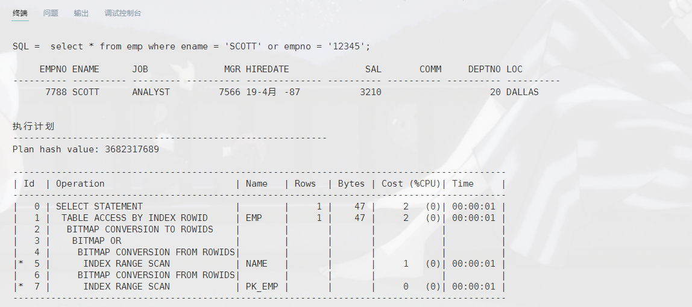
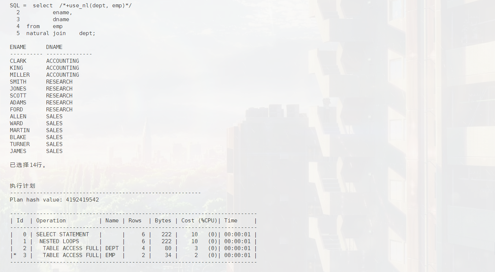
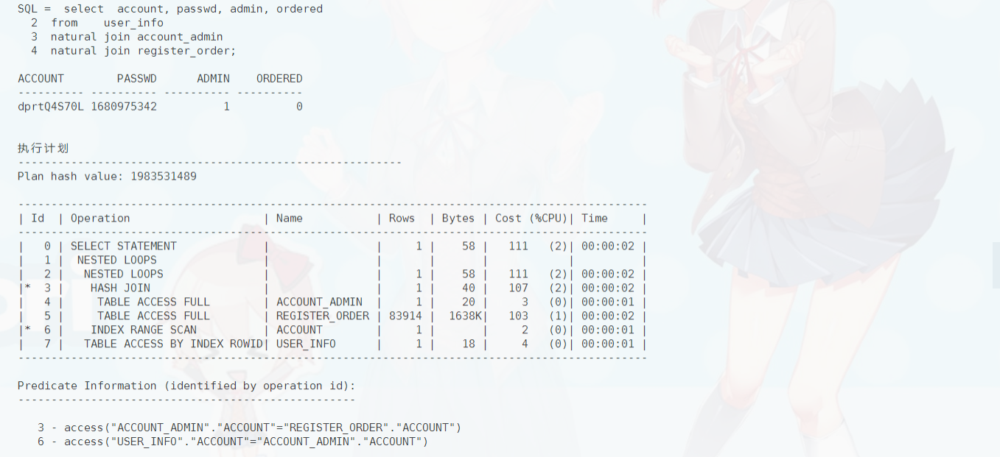
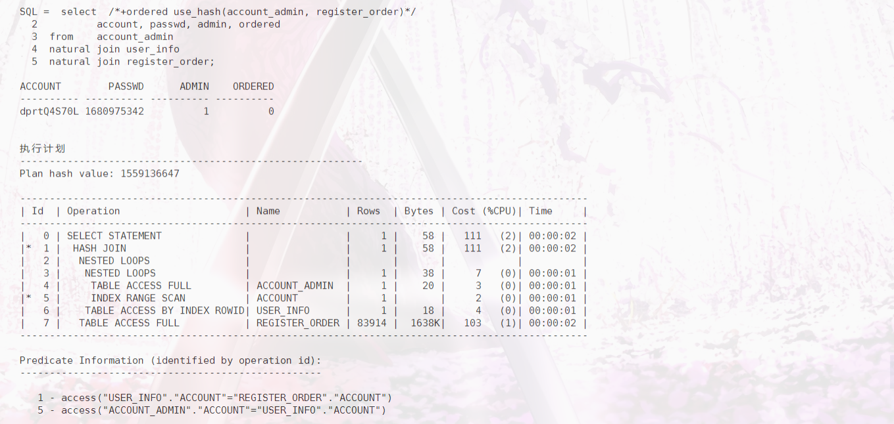

# 数据库第十七周作业
`19336035` `陈梓乐`

1. **使用 3.7.2 的方法，编码下列位图：**
- 01100000010000000100
$\rightarrow(1, 0, 6, 7)\rightarrow 0100110110110111$
- 100000001000001001010001
$\rightarrow(0, 7, 5, 2, 1, 3)\rightarrow001101111101011010011011$
- 0001000000000001000010000
$\rightarrow(3, 11, 4)\rightarrow101111101011110100$

2. **构造一个表和有关查询，用执行计划证明建立普通的 B+树索引不能优化此查询，但建立位图索引则可以。提示：在 Oracle 中建立位图索引的命令是 `create bitmap index …`**

我们先在 `emp.ename, emp.empno` 建立位图索引，来执行以下命令：
```sql
select * from emp where ename = 'SCOTT' or empno = '12345';
```
下图将表明 Oracle 采用的是位图索引优化而非普通的 B+ 树优化：



3. **读完第 17 周课程幻灯片未讲完的部分，试举出 3 个自然连接的例子，分别使用 nestedloop、hash join、sort merge 来进行连接（展示其执行计划）。提示：可以使用 hints，在《SQL Reference》一书里有详细的 hints 列表和用途解释** 

- nestedloop
```sql
select  /*+use_nl(dept, emp)*/ 
        ename, 
        dname 
from    emp 
natural join    dept;
```


- hash join
```sql
select ename, dname from emp natural join dept; 
```


- sort merge
```sql
select  /*+use_merge(dept, emp) */ 
        ename, 
        dname 
from    emp 
natural join    dept;
```


4. **关于连接次序的测试。构造一个 t1、t2、t3 的三表连接，通过设计数据使其中 t1 和 t2 的连接会产生较多的结果，t2 和 t3 的连接产生较少的结果，理论上先连接 t2 和 t3 是较为明智的执行计划，看下 Oracle 是否会自动选择这样的计划？改变三个表的书写次序，观察对执行计划是否有影响？我们的目标是希望让 Oracle 生成一个愚蠢的执行计划，然后用 hints 直接指定连接次序，人为强制Oracle按最有次序执行连接。对于安装了MySQL或PostgreSQL的同学，也可以在相应环境中做一下这个实验**

我们准备了三张表，每张表都有两列，参数如下：

|表名|行数|列名01|类型01|列名02|类型02|
|-|-|-|-|-|-|
|user_info|1500628|account|varchar2(10)|passwd|number(10)|
|account_admin|1|account|varchar2(10)|admin|number(2)|
|register_order|100001|account|varchar2(10)|ordered|number(7)|

我们来把这三张表连接，对比以下三段代码：
```sql
select  account, passwd, admin, ordered
from    user_info
natural join register_order
natural join account_admin;

select  account, passwd, admin, ordered
from    user_info
natural join account_admin
natural join register_order;

select  account, passwd, admin, ordered
from    account_admin
natural join user_info
natural join register_order;
```

我们知道连接时最好以 `account_admin` 为中心连接，我们来看看各自性能分析：




可以看到，上图反映了如下事实：
- 更改书写顺序将改变表的连接顺序
- Oracle 并不会自动选择连接先后顺序，或只能在一定范围内智能选择。
- 最差的写法是第三种写法，它先决定连接最多行数的两个表，再来连接第三个表

这样，我们来修改第三种写法，加上hints，使得它先连接记录较少的表：
```sql
select  /*+ordered use_hash(account_admin, register_order)*/
        account, passwd, admin, ordered
from    account_admin
natural join user_info
natural join register_order;
```

下图将说明我们的修改有助于 Oracle 先连接 account_admin 和 register_order。

