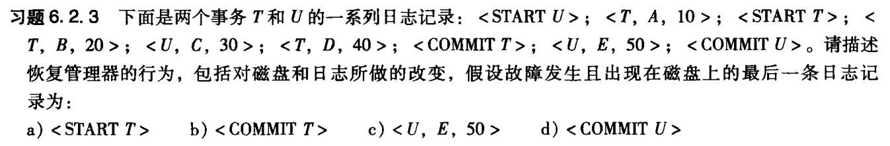
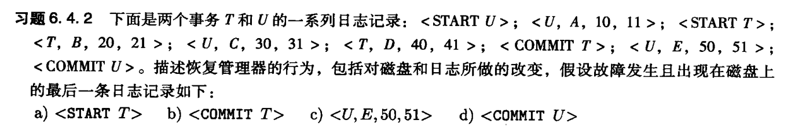

# 数据库第18周作业

`19336035` `陈梓乐`

---

> 
<b>警示：题中 START U 与 START T 互换</b>

(a) 
- 硬盘不做任何改变，因为未扫描到值修改记录
- 日志写入 `<ABORT T>`，因为未找到 `<COMMIT T>` 的记录

(b)
- 硬盘写入 `C := 30`，因为尽管扫描到了 `<COMMIT T>` 的记录，却未扫描到 `<COMMIT U>` 的事务，从而应该从后往前恢复事务 `U` 所做的更改，而在 `<COMMIT T>` 日志记录之前，唯一找到的关于事务 `U` 所做的更改为 `<U, C, 30>`
- 日志写入 `<ABORT U>`

(c)
- 硬盘写入 `E := 50, C := 30`，理由与 (b) 相同
- 日志写入 `<ABORT U>`

(d)
- 硬盘和日志不做任何更改，因为所有事务都已经提交

(a)
- 硬盘不做任何改变，因为扫描不到任何提交的事务
- 日志写入 `<ABORT T>`，因为找到了 `<START T>` 却没有找到 `<COMMIT T>`

(b)
- 硬盘写入 `A := 10, B := 20, D := 40` 因为找到了 `<COMMIT T>`，于是必须重做事务 `T` 所做的修改。
- 日志写入 `<ABORT U>`，因为只找到了 `<START U>` 却未找到 `<COMMIT U>`

(c)
- 硬盘和日志所做的操作与理由与 (b) 一致

(d)
- 硬盘写入 `A := 10, B := 20, C := 30, D := 40, E := 50`，因为找到了 `<COMMIT U>` 和 `<COMMIT T>`，故必须重做两个事务的所有修改。
- 日志不做任何改变，因为未找到未提交的事务

设事件：
|重做 `U`||撤销 `U`||重做 `T`||撤销 `T`||
|:-:|:-:|:-:|:-:|:-:|:-:|:-:|:-:|
|令变量为|值|令变量为|值|令变量为|值|令变量为|值|
|A|11|E|50|B|21|D|40|
|C|31|C|30|D|41|B|20|
|E|51|A|10|无||||

于是：
(a)
- 硬盘写入 `A := 10`，因为事务 `U` 和 `V` 都未提交，必须撤销所做更改
- 日志写入 `<ABORT U>, <ABORT T>`

(b) 
- 硬盘完成操作：
    - 重做 `T`，因为 `T` 已经提交。
    - 写入 `C := 30`，因为事务 `U` 未提交，必须撤销所做更改
- 日志写入 `<ABORT U>`

(c)
- 硬盘完成操作：
    - 重做 `T`，因为 `T` 已经提交。
    - 撤销 `U`，因为 `U` 未提交。
- 日志写入 `<ABORT U>`

(d)
- 硬盘重做事务 `U` 和 `T`，因为事务 `U` 和 `V` 都已经提交。
- 日志不做任何更改。