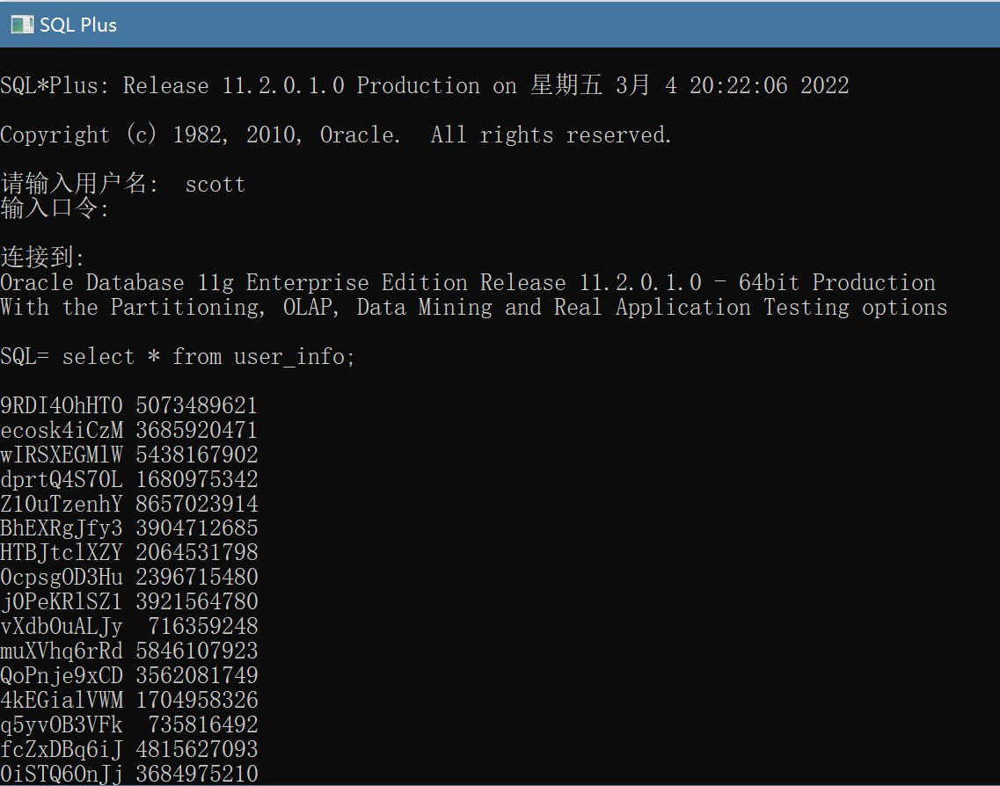

# 数据库第三周作业

19336035 陈梓乐

---
[TOC]
---

## 写出以下SQL, 要求一条语句完成
### a. 显示员工的姓名和雇佣时间，要求使用中文时间格式

```sql
SQL =  SELECT ENAME, TO_CHAR(HIREDATE, 'yyyy"年"fmmm"月"dd"日"') FROM EMP; 

ENAME      TO_CHAR(HIREDA
---------- --------------
SMITH      1980年12月17日
ALLEN      1981年2月20日
WARD       1981年2月22日
JONES      1981年4月2日
MARTIN     1981年9月28日
BLAKE      1981年5月1日
CLARK      1981年6月9日
SCOTT      1987年4月19日
KING       1981年11月17日
TURNER     1981年9月8日
ADAMS      1987年5月23日
JAMES      1981年12月3日
FORD       1981年12月3日
MILLER     1982年1月23日

已选择14行。
```

### b. 显示员工的姓名和总收入，总收入以 $ 开头，带小数点后两位

```SQL
SQL =  SELECT ENAME, TO_CHAR(SAL+NVL(COMM, 0), '$99999.99') FROM EMP;      

ENAME      TO_CHAR(SA
---------- ----------
SMITH         $800.00
ALLEN        $1900.00
WARD         $1750.00
JONES        $2975.00
MARTIN       $2650.00
BLAKE        $2850.00
CLARK        $2450.00
SCOTT        $3000.00
KING         $5000.00
TURNER       $1500.00
ADAMS        $1100.00
JAMES         $950.00
FORD         $3000.00
MILLER       $1300.00

已选择14行。

```

### c. 显示员工雇佣时间的十年后第一个4月1日

```SQL
SELECT ENAME, 
    (CASE
        WHEN TO_CHAR(HIREDATE, 'MM-DD') < '04-02' THEN
            TO_CHAR(ADD_MONTHS(HIREDATE, 120), 'YYYY-"04-01"')
        ELSE
            TO_CHAR(ADD_MONTHS(HIREDATE, 132), 'YYYY-"04-01"')
        END
    ) GIFT FROM EMP;

ENAME      GIFT
---------- ----------
SMITH      1991-04-01
ALLEN      1991-04-01
WARD       1991-04-01
JONES      1992-04-01
MARTIN     1992-04-01
BLAKE      1992-04-01
CLARK      1992-04-01
SCOTT      1998-04-01
KING       1992-04-01
TURNER     1992-04-01
ADAMS      1998-04-01
JAMES      1992-04-01
FORD       1992-04-01
MILLER     1992-04-01

已选择14行。
```
### d. 列出员工号和姓名，所属部门名称，要求员工号用中文大写

```sql
SELECT TRANSLATE(
    EMPNO,
    '0123456789',
    '零壹贰叁肆伍陆柒捌玖'
)EMPNO, ENAME, DNAME from EMP E,DEPT D where (
    E.DEPTNO=D.DEPTNO
);

EMPNO                                                                            ENAME      DNAME
-------------------------------------------------------------------------------- ---------- --------------
柒柒捌贰                                                                         CLARK      ACCOUNTING
柒捌叁玖                                                                         KING       ACCOUNTING
柒玖叁肆                                                                         MILLER     ACCOUNTING
柒伍陆陆                                                                         JONES      RESEARCH
柒玖零贰                                                                         FORD       RESEARCH
柒捌柒陆                                                                         ADAMS      RESEARCH
柒叁陆玖                                                                         SMITH      RESEARCH
柒柒捌捌                                                                         SCOTT      RESEARCH
柒伍贰壹                                                                         WARD       SALES
柒捌肆肆                                                                         TURNER     SALES
柒肆玖玖                                                                         ALLEN      SALES
柒玖零零                                                                         JAMES      SALES
柒陆玖捌                                                                         BLAKE      SALES
柒陆伍肆                                                                         MARTIN     SALES
```

## 完成以下题目
### `To_date` 如果没有指定时分秒，缺省的时分秒是？
12:00:00

### 如果指定的年份是45，那产生1945年还是2045年？
2045

### 中文字符有多长？
1

### 中英混合的字符串，substr会乱套吗？
不会


### Varchar2（10）的字段，可以放5个中文字符还是10个？
5个

## 3. 转移数据

- 导出数据
在 sqlplus 中创建目录并授权，在 powershell 中导出。
```sql
SQL =  create directory dump_dir as 'D:\Work\数据库';

目录已创建。

SQL =  grant read,write on directory dump_dir to scott;

授权成功。

PS D:\Work\数据库> expdp scott/tiger@ORCL tables=user_info dumpfile=user_info.dmp directory=dump_dir
```

导出截图如下：


- 导入数据
同样创建逻辑目录并授权，然后输入：
```sql
SQL= create directory dump_dir as 'C:\DATA\数据库'
  2  ;

目录已创建。

SQL= grant read,write on directory dump_dir to scott;

授权成功。

impdp scott/oracle@ORCL directory=dump_dir dumpfile=USER_INFO.DMP
```
截图如下：


