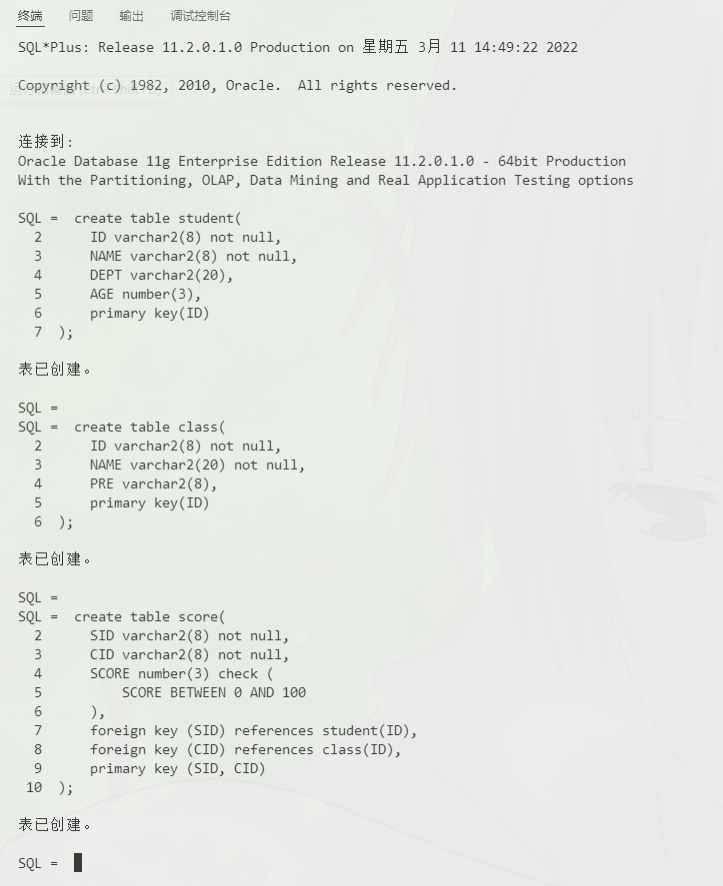
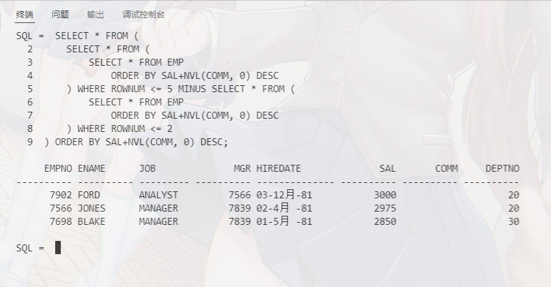
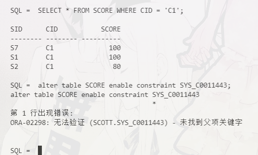
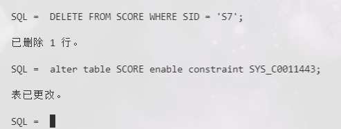
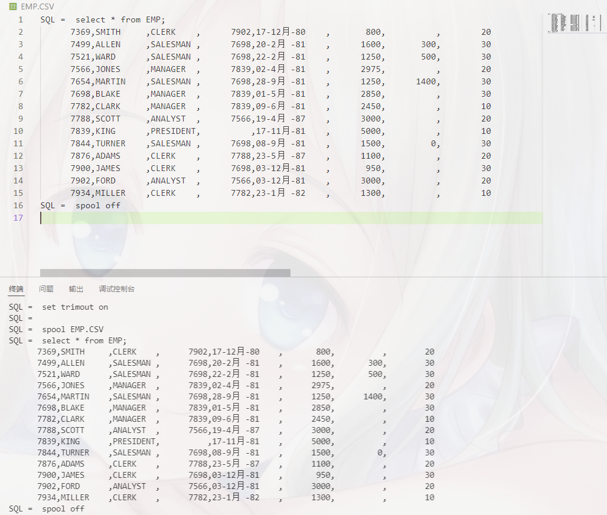

# 数据库第四次作业
19336035 陈梓乐

---
[TOC]
---

## 1. 写出创建相应表格的SQL语句

### 创建表
```sql
create table student(
    ID varchar2(8) not null,
    NAME varchar2(8) not null,
    DEPT varchar2(20),
    AGE number(3),
    primary key(ID)
);

create table class(
    ID varchar2(8) not null,
    NAME varchar2(20) not null,
    PRE varchar2(8),
    primary key(ID)
);

create table score(
    SID varchar2(8) not null,
    CID varchar2(8) not null,
    SCORE number(3) check (
        SCORE BETWEEN 0 AND 100
    ),
    foreign key (SID) references student(ID),
    foreign key (CID) references class(ID),
    primary key (SID, CID)
);
```

创建表的截图如下：



---
### 插入数据

创建ctl文件
```sql
OPTIONS (skip=0) 
load data
INFILE  'student_data.csv'  
insert into table student
FIELDS TERMINATED BY ', '
trailing nullcols (
    ID,
    NAME,
    DEPT,
    AGE
)
......(略去其他两个ctl文件)
```

在 terminal 中，输入：
```
sqlldr scott/tiger control=Load.ctl
```

现在我们来看导入效果：


略去插入错误数据的部分。


---
### 列出工资从高到低排序的第3-5名员工
```sql
SELECT * FROM (
    SELECT * FROM (
        SELECT * FROM EMP 
            ORDER BY SAL+NVL(COMM, 0) DESC
    ) WHERE ROWNUM <= 5 MINUS SELECT * FROM (
        SELECT * FROM EMP 
            ORDER BY SAL+NVL(COMM, 0) DESC
    ) WHERE ROWNUM <= 2
) ORDER BY SAL+NVL(COMM, 0) DESC;
```

效果如下：


## 关闭外键约束，插入很坏很坏的数据，看看长啥样

查询外键约束命名：
```sql
SELECT 
'alter table '||table_name||' enable constraint '||constraint_name||';' 
FROM user_constraints WHERE 
constraint_type='R';
```
修改约束：
```sql
alter table SCORE disable constraint SYS_C0011443;
```
插入数据：
```sql
INSERT INTO SCORE
VALUES (
    'S7',
    'C1',
    100
);
```

开启约束
```sql
alter table SCORE enable constraint SYS_C0011443;
```


删除坏数据，再开启约束


## 导出EMP到EXCEL中
```sql
set colsep  ,
set feedback off
set heading off
set newp none
set pagesize 0
set linesize 200
set trimout on

spool EMP.CSV

select * from EMP;  

spool off  
exit
```

效果如下：
