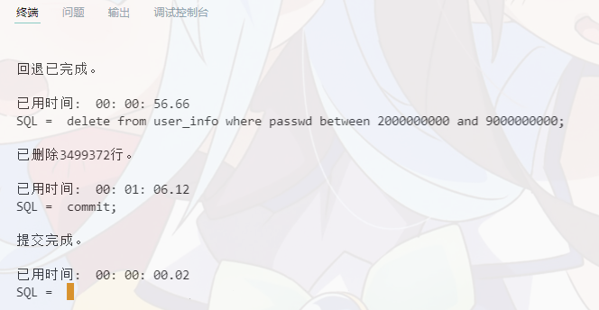

# 数据库第5次作业

---
[toc]
---

## 1. 比较 rollback 和 commit 运行的时间快慢
```sql
select * from user_info where 
    passwd between 2000000000 and 9000000000;       // 检查要删除的内容
delete from user_info where
    passwd between 2000000000 and 9000000000;       // 删除

已删除3499372行。

set timing on;                                      // 开启计时器
rollback;                                           // 回退

回退已完成。

已用时间:  00: 00: 56.66

delete from user_info where
    passwd between 2000000000 and 9000000000;       // 删除

已删除3499372行。

已用时间:  00: 01: 06.12

commit;

提交完成。

已用时间:  00: 00: 00.02
```

部分截图如下：


## 2. 给在波士顿、纽约、芝加哥、达拉斯的员工分别加薪300、500、380、210美元。

```sql
update emp set sal = sal + (
    case deptno
        when (
            select deptno from dept where loc = 'DALLAS'
        ) then 210
        when (
            select deptno from dept where loc = 'CHICAGO'
        ) then 380
        when (
            select deptno from dept where loc = 'NEW YORK'
        ) then 500
        when (
            select deptno from dept where loc = 'BOSTON'
        ) then 300
    end
);
```
截图如下：


## 3. 建立一个有多个重复行的表，然后去重。
### 建表
建一个新闻表
```sql
create table news(
    newsno number(3),
    title varchar2(1000),
    class varchar2(20),
    source varchar2(1000),
    link varchar2(2000),
    rating number(2)
);
```
### 生成数据
使用 python 在网络爬取新闻并储存，代码如下：
```python
import cx_Oracle, json
import numpy as np

def insertData():
    con = cx_Oracle.connect('scott/tiger@127.0.0.1/ORCL')
    news = json.loads(open('news.json', encoding='utf-8').read())['news']
    news = [(
        i['order'],
        i['news'],
        i['class'],
        i['source'],
        i['link'],
        i['rating']
    ) for i in news]

    news = [news[i] for i in np.random.randint(0, len(news)-1, size=1000)]
    true_news = set(news)
    cur = con.cursor()
    try:
        cur.bindarraysize = len(news)
        cur.setinputsizes(int, 300)
        cur.executemany("insert into news values (:1, :2, :3, :4, :5, :6)", news)
        con.commit()
    except Exception as e:
        print(e)
        con.rollback()
    con.close()
    print(f'已插入 {len(news)} 行，非重复行数{len(true_news)}行')

insertData()
```
然后运行：
```bash
PS D:\Work\数据库> python 5.py
已插入 1000 行，非重复行数609行
```

### 去重
```sql
delete from news where
    newsno in (
        select newsno from news 
            group by (newsno) having count(*) > 1
    ) and rowid not in (
        select min(rowid) from news
            group by (newsno) having count(*) > 1
    );

已删除391行。
```


### 效果展示


## 4. 给 EMP 表增加一列LOC，记录每个员工所在城市。

```sql
alter table emp add (
    LOC varchar2(10)
);
update emp set LOC = (
    select loc from dept
        where deptno = emp.deptno
);
```
效果如下：


## 5. 通过 `ALTER SESSION SET ISOLATION_LEVEL=SERIALIZABLE; ` 改变会话的隔离级别，观察事务读写隔离逻辑的影响（缺省的隔离级别是READ COMMITTED） 
>提示：打开2 个sqlplus 窗口，都用scott 登录，在其中一个进行update 或commit，在另外一个窗口观察数据的变化。 

1. 默认情况下，在更改未提交时开启另一事务进行查询，显示的是更改前的数据。（参考第二题的图）当事务完成后，显示的是提交后的数据。
2. 改变隔离等级后，两个事务中，其中一个提交，另一个查询不改变，也就是以事务为单位进行隔离。否则若进行事务并行修改，将报错 `ORA-08177`.


## 6. 把工资从高到低排名10-12名的员工加薪300美元

```sql
update emp set sal = sal + 300 where ename in (
    SELECT ename FROM (
        SELECT * FROM (
            SELECT * FROM EMP 
                ORDER BY SAL+NVL(COMM, 0) DESC
        ) WHERE ROWNUM <= 12 MINUS SELECT * FROM (
            SELECT * FROM EMP 
                ORDER BY SAL+NVL(COMM, 0) DESC
        ) WHERE ROWNUM <= 9
    )
);

```
效果如下：


## 7. 找出工资比下属低的员工，将工资加到与下属相同。
```sql
update emp set sal = (
    select max(sal) from (
        select * from emp
    ) where mgr = emp.empno
) where sal < (
    select max(sal) from (
        select * from emp
    ) where mgr = emp.empno
);
```
效果展示：


## 8. 用B表的数据更新A表

利用 `user_info` 表，我们建立新表：
```sql
create table new_info(
    account varchar2(10),
    passwd number(10)
);

insert into new_info values ('Kfhkj7ieN2', 11111111);
```

更新数据
```sql
update user_info u
set u.passwd = (
    select passwd from new_info n
        where n.account = u.account
) where exists (
    select * from new_info n
        where n.account = u.account
);
```

效果展示


