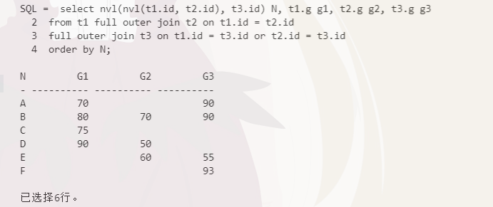
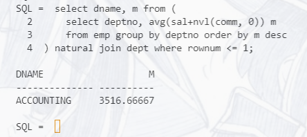
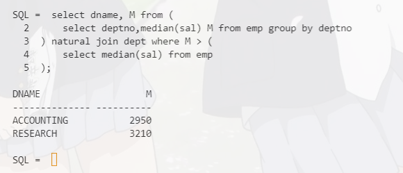
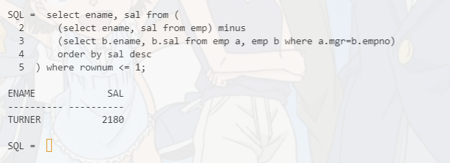
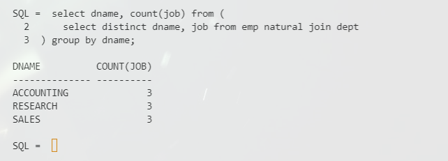
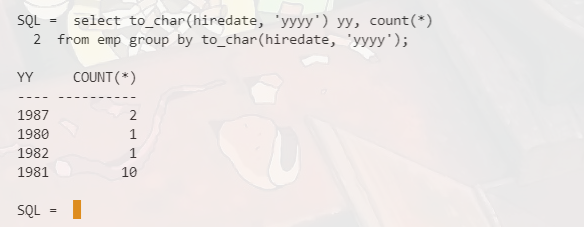
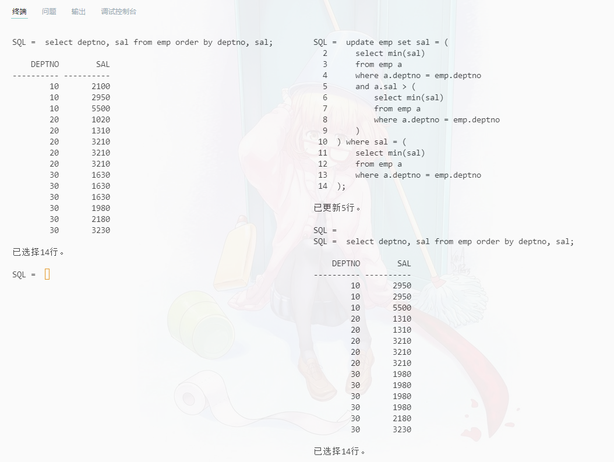

# 数据库第六次作业
19336035 陈梓乐

---
## 1. 尝试进行多表连接

创建表
```sql {.line-numbers}
create table t1 (id char(1), g number(3));
create table t2 (id char(1), g number(3));
create table t3 (id char(1), g number(3));

INSERT INTO t1 VALUES('A',70);
INSERT INTO t1 VALUES('B',80);
INSERT INTO t1 VALUES('C',75);
INSERT INTO t1 VALUES('D',90);

INSERT INTO t2 VALUES('B',70);
INSERT INTO t2 VALUES('D',50);
INSERT INTO t2 VALUES('E',60);

INSERT INTO t3 VALUES('A',90);
INSERT INTO t3 VALUES('B',90);
INSERT INTO t3 VALUES('E',55);
INSERT INTO t3 VALUES('F',93);
```

连接表
```sql {.line-numbers}
select nvl(nvl(t1.id, t2.id), t3.id) N, t1.g g1, t2.g g2, t3.g g3
from t1 full outer join t2 on t1.id = t2.id
full outer join t3 on t1.id = t3.id or t2.id = t3.id
order by N;
```


## 2. 完成以下SQL语句
1. 列出平均总收入（工资+提成）最高的部门名称
```sql {.line-numbers}
select dname, m from (
    select deptno, avg(sal+nvl(comm, 0)) m
    from emp group by deptno order by m desc
) natural join dept where rownum <= 1;
```


2. 列出部门工资中位数比公司工资中位数高的部门名称
```sql {.line-numbers}
select dname, M from (
    select deptno,median(sal) M 
    from emp 
    group by deptno
) natural join dept where M > (
    select median(sal) from emp
);
```


3. 求底层员工（即没有直属下属）中工资最高的员工名字
```sql {.line-numbers}
select ename, sal from (
    select ename, sal from emp minus (
        select b.ename, b.sal 
        from emp a, emp b 
        where a.mgr=b.empno
    ) order by sal desc
) where rownum <= 1;
```


4. 列出部门的名称和部门内员工的不同工种数
```sql {.line-numbers}
select dname, count(job) from (
    select distinct dname, job 
    from emp natural join dept
) group by dname;
```


5. 求每年进入公司工作的员工数
```sql {.line-numbers}
select to_char(hiredate, 'yyyy') yy, count(*) 
from emp group by to_char(hiredate, 'yyyy');
```



6. 把每个部门工资最低的员工的工资调整到与该部门倒数第 2 一致（注意有并列的情况）
```sql {.line-numbers}
select deptno, sal from emp order by deptno, sal;

update emp set sal = (
    select min(sal)
    from emp a
    where a.deptno = emp.deptno
    and a.sal > (
        select min(sal)
        from emp a
        where a.deptno = emp.deptno
    )
) where sal = (
    select min(sal) 
    from emp a
    where a.deptno = emp.deptno
);

select deptno, sal from emp order by deptno, sal;
```


## 3. 实验对 `emp` 表中的某些行 `select...for update`。观察其它会话对 `emp` 表进行的读写操作受到什么影响。

select for update 后直到 commit 为止，无法开启其他关于指定行的修改事务。

## 4. 给出第 6 周课程幻灯片第 3 页中提到的“ITPUB 论坛盗币事件”的解决方案

```python
try:
    select ...
    update ...
    money = select ...
    if money < 0:
        raise Exception()
    else:
        commit
except:
    rollback()
    send_error()
```