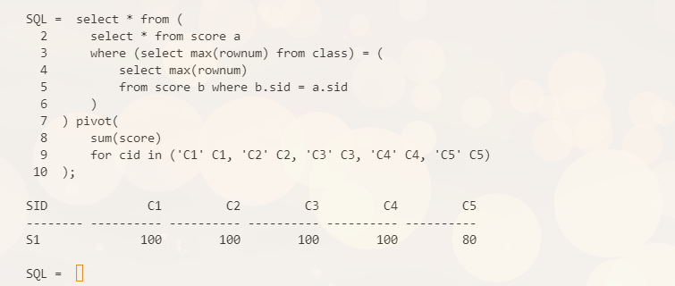

# 数据库第七次作业
`19336035` `陈梓乐`

---

**1. 养成注重代码可读性与可维护性的习惯。参照堂上讲述和网上资料，为自己订立一套 SQL 书写规范，内容包括但不限于：关键词书写，表名列名书写，大小写规则，换行规则，行长度规范，缩进规范，括号位置，注释，模块化等。以后作业均按此规范书写。**


> 1. 语句中出现的所有表名、字段名全部小写，系统保留字、内置函数名、Sql 保留字大写。
> 2. 连接符 or、in、and、以及＝、=等前后加上一个空格。
> 3. 对较为复杂的 sql 语句加上注释，说明算法、功能。
**注释风格：注释单独成行、放在语句前面。**
*(1) 应对不易理解的分支条件表达式加注释；
(2) 对重要的计算应说明其功能；
(3) 过长的函数实现，应将其语句按实现的功能分段加以概括性说明；
(4) 每条 SQL 语句均应有注释说明（表名、字段名）。
(5) 常量及变量注释时，应注释被保存值的含义(必须)，合法取值的范围(可选)
(6) 可采用单行/多行注释。（-- 或 /* */ 方式）*
> 4. SQL 语句的缩进风格
*(1) 一行有多列，超过 80 个字符时，基于列对齐原则，采用下行缩进
(2) where 子句书写时，每个条件占一行，语句令起一行时，以保留字或连接符开始，连接符右对齐。*
> 5. 多表连接时，使用表的别名来引用列。
> 6. 供别的文件或函数调用的函数，绝不应使用全局变量交换数据；
> 7. 查找数据库表或视图时，只能取出确实需要的那些字段，不要使用*来代替所有列名。要清楚明白地使用列名，而不能使用列的序号。

from [https://xie.infoq.cn/article/c2872448937aed42db9b69119](https://xie.infoq.cn/article/c2872448937aed42db9b69119)

**2. 在学生选修表 SC 与课程表 C 放置一些数据，写一条 SQL 求出选修了 C 表所列全部课程的学生名单**

先来查看以下原始数据：
```sql
select * from score pivot(
    sum(score)
    for cid in ('C1', 
    'C2', 'C3', 'C4', 'C5')
);
```

```sql
select * from (
    select * from score a
    where (select max(rownum) from class) = (
        select max(rownum)
        from score b where b.sid = a.sid
    )
) pivot(
    sum(score)
    for cid in ('C1' C1, 'C2' C2, 'C3' C3, 'C4' C4, 'C5' C5)
);
```



**3. 在 SC 表中加入大量数据，然后用 pivot 函数将它转为宽表 SCwide。再用 unpivot 函数将 SCwide 转为窄表**
转为宽表如第二题所示，下面只演示转为窄表：
```sql
with scwide as (
    select * from score pivot(
        sum(score)
        for cid in ('C1' C1, 'C2' C2, 'C3' C3, 'C4' C4, 'C5' C5)
    )
)
select * from scwide
unpivot (score for cid in (C1, C2, C3, C4, C5));
```


**4. 用 1 条 SQL 语句建立以下统计表格，分别统计每个部门，每个年份进入公司，每个工种的人数**

1. 每个部门的人数
```sql
create table dept_count (dname, num) as
select dname,count(*)
from emp
natural join dept
group by dname;
```

2. 每个年份进入公司的人数
```sql
create table year_count (year, num) as
select to_char(hiredate, 'yyyy') year,count(*)
from emp
group by to_char(hiredate, 'yyyy');
```


3. 每个工种的人数
```sql
create table job_count (job, num) as
select job,count(*)
from emp
group by job;
```


**4. 有 A，B 两张表，均有 C1，C2 两列，C1 代表商品名称，C2 代表商品价格。B 中的商品有些是 A 中的原有商品，有些是在 A 中没有的新商品，要求对 A 表进行更新修改，B 中原有商品用 B 里的新价格覆盖 A 的原价格，B 中的新商品则插入到 A 中，要求 1 条 SQL 语句完成。**

以上题中 `job_count` 为例，创建新表：
```sql
create table job_count_new (job, num) as
select job, num+1 from job_count
where num = 4;

insert into job_count_new values('SUPPORTER', 2);
```


接下来我们用 `job_count_new` 来更新 `job_count` 。
```sql
merge into job_count
using job_count_new
on (job_count.job = job_count_new.job)
when matched then 
    update set job_count.num = job_count_new.num
when not matched then
    insert values (
        job_count_new.job,
        job_count_new.num
    );
```
