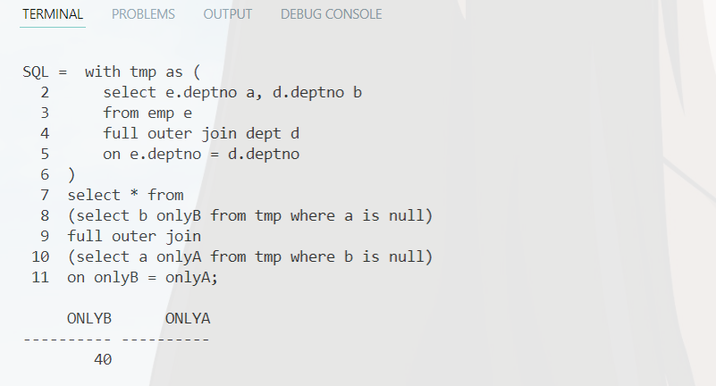
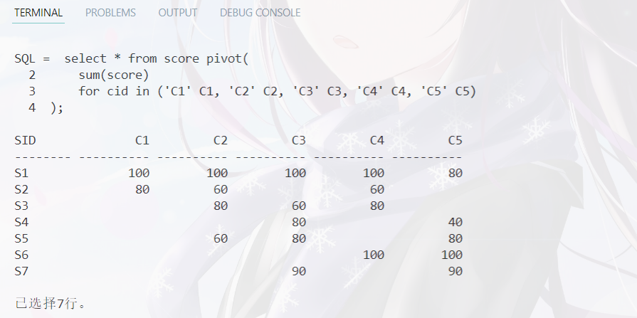
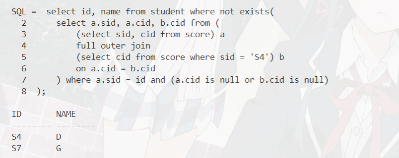
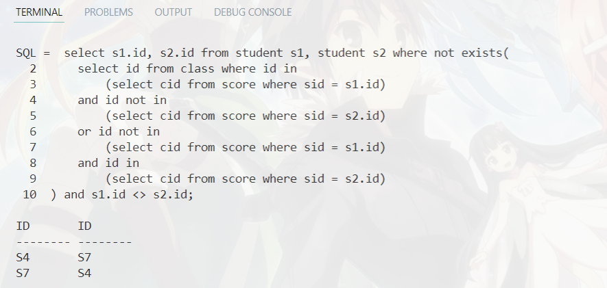
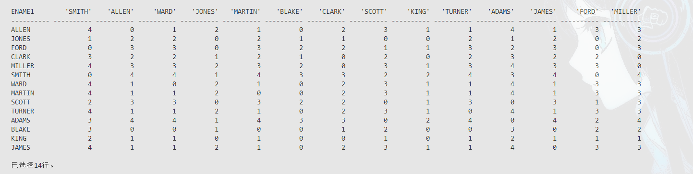

# 数据库第八周作业
`19336035` `陈梓乐`

---
[TOC]
---

## 1. 解决第 8 周课程幻灯片第 15 页的 3 个问题
1. **怎样用一条SQL语句判断两个集合（假设都没有重复元素）是否相等或是子集关系？**

以 `emp` 表和 `dept` 表为例，我们要找他们的 `deptno` 列是否为子集关系，为此只需找仅在其中一个集合出现的元素即可。
```sql
with tmp as (
    select e.deptno a, d.deptno b
    from emp e
    full outer join dept d
    on e.deptno = d.deptno
)
select * from 
    (select b onlyB from tmp where a is null)
    full outer join
    (select a onlyA from tmp where b is null)
    on onlyB = onlyA;
```


2. **列出选修课程与某位指定同学完全一样的同学**

我们先来查看一下数据：
```sql
select * from score pivot(
    sum(score)
    for cid in ('C1' C1, 'C2' C2, 'C3' C3, 'C4' C4, 'C5' C5)
);
```


接着我们来查找与 `S4` 选修课程一模一样的学生：
```sql
select id, name from student where not exists(
    select a.sid, a.cid, b.cid from (
        (select sid, cid from score) a
        full outer join
        (select cid from score where sid = 'S4') b
        on a.cid = b.cid
    ) where a.sid = id and (a.cid is null or b.cid is null)
);
```
显然我们应该选出 `S4` 和 `S7` 出来：


3. **列出所有选修课程完全一样的同学名单，以学号对的形式输出结果**

我们只要两两判断即可：
```sql
select s1.id, s2.id from student s1, student s2 where not exists(
    select id from class where id in 
        (select cid from score where sid = s1.id)
    and id not in 
        (select cid from score where sid = s2.id)
    or id not in
        (select cid from score where sid = s1.id)
    and id in
        (select cid from score where sid = s2.id)
) and s1.id <> s2.id;
```



## 2. 解决第 8 周课程幻灯片第 56 页的 2 个问题
1. **假设每个人都只能和直接上司或直接下属交流，求任意两人间交流信息需要经过的最小中间节点数。**

设 `layer` 表示经手的最少领导数，则关键是求出两个员工之间特有的领导的数量，记为 `unique_leader`。
```sql{.line-numbers}
with tmp as (
    select a.ename i, b.ename j from emp a, emp b
    where b.empno in (
        select empno from emp
        start with empno = a.empno
        connect by prior mgr = empno 
    ) and a.ename <> b.ename
) select a.ename ename1, b.ename ename2, (
    case 
    when b.ename = a.ename then 0
    when b.ename in (select j from tmp where i = a.ename) or
        a.ename in (select j from tmp where i = b.ename) then (
        select count(*) - 1 from emp where ename in (
            select j from tmp where i = b.ename
        union
            select j from tmp where i = a.ename
        minus (
            select j from tmp where i = a.ename
        intersect
            select j from tmp where i = b.ename
        ))
    )
    else (
        select count(*) + 1 from emp where ename in (
            select j from tmp where i = b.ename
        union
            select j from tmp where i = a.ename
        minus (
            select j from tmp where i = a.ename
        intersect
            select j from tmp where i = b.ename
        ))
    ) end
) layer from emp a, emp b;
```
为表示效果，本代码不附上截图，请参照第二小问的截图。

2. **能否用宽表展示结果？**

参照以下代码：
```sql{.line-numbers}
with tmp as (
    select a.ename i, b.ename j from emp a, emp b
    where b.empno in (
        select empno from emp
        start with empno = a.empno
        connect by prior mgr = empno 
    ) and a.ename <> b.ename
) select * from (
    select a.ename ename1, b.ename ename2, (
        case 
        when b.ename = a.ename then 0
        when b.ename in (select j from tmp where i = a.ename) or
            a.ename in (select j from tmp where i = b.ename) then (
            select count(*) - 1 from emp where ename in (
                select j from tmp where i = b.ename
            union
                select j from tmp where i = a.ename
            minus (
                select j from tmp where i = a.ename
            intersect
                select j from tmp where i = b.ename
            ))
        )
        else (
            select count(*) + 1 from emp where ename in (
                select j from tmp where i = b.ename
            union
                select j from tmp where i = a.ename
            minus (
                select j from tmp where i = a.ename
            intersect
                select j from tmp where i = b.ename
            ))
        ) end
    ) layer from emp a, emp b
) pivot (
    sum(layer)
    for ename2 in (
        'SMITH','ALLEN','WARD','JONES','MARTIN',
        'BLAKE','CLARK','SCOTT','KING','TURNER','ADAMS',
        'JAMES','FORD','MILLER'
    )
);
```

效果如下，经检验结果正确。



## 3. 阅读第 8 周课程幻灯片第 57 页关于用 1 条 SQL 解决八皇后问题的代码
> 1） 给代码加上适当的注释，使我们能看明白解决问题的思路
2） 修改代码解决十皇后问题
3） （可选）用 SQL 解决 N 皇后问题，截图结果（包括部分解和解的总数）直接发给老师，
N 最大者（可并列）可以获得总评加分 2 分奖励，加油！

将注释放在修改后的代码中，并附上十四皇后代码的运行结果，十皇后只需修改对应参数。事实上，我们只需用两位数字表示一个皇后的位置即可。

```sql{.line-numbers}
with sou as (
    select level n,1 k from dual connect by level<=14       /* Select a position*/
), ntt(n,k) as (
    select sou.n ,sou.k from sou where k=1
    union all
    select ntt.n*100+a.n, ntt.k+1                           /* Record the position*/
    from ntt,sou a
    /* If there is no conflict between the new position and the recorded position*/
    where not exists(                                       
        select 1
        from  (select level b1 from dual connect by level<=13) t    /* a range */
        where t.b1<=ntt.k and (
            /* If the first position is 0 ~ 9, we convert it in format 01 ~ 09 */
            ntt.n < power(10, 2*ntt.k-1) and (
                a.n=to_number(substr(0||to_char(ntt.n),b1 * 2 - 1,2)) or
                a.n=to_number(substr(0||to_char(ntt.n),b1 * 2 - 1,2))+(ntt.k+1-t.b1) or
                a.n=to_number(substr(0||to_char(ntt.n),b1 * 2 - 1,2))-(ntt.k+1-t.b1) 
            ) or ntt.n >= power(10, 2*ntt.k-1) and (
                a.n=to_number(substr(to_char(ntt.n),b1 * 2 - 1,2)) or
                a.n=to_number(substr(to_char(ntt.n),b1 * 2 - 1,2))+(ntt.k+1-t.b1) or
                a.n=to_number(substr(to_char(ntt.n),b1 * 2 - 1,2))-(ntt.k+1-t.b1)
            )
        )
        ) and ntt.k<=13
)
select to_char(n) from ntt where ntt.k=14;
```
