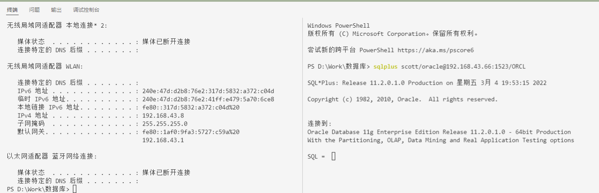

# 连接远程服务器
19336035 陈梓乐

---
<center><b>本作业与 19336095 刘帆同学进行连接，故共用截图 </b></center>

---

## 环境配置
使用手机热点建立小型内网，使用 `ipconfig` 命令查看服务端与客户端的 ipv4 地址。
## 服务端设置
1. 在Windows安全设置中关闭Windows Defender防火墙
2. 开启监听服务
```bash
lsnrctl start
```
## 客户端
输入以下命令即可
```bash
sqlplus scott/oracle@192.168.43.66:1523/ORCL
```

以下截图说明连接成功，从命令行可看出本地电脑与远程服务器的IP地址不同，说明数据库来源于远程计算机。


sqlplus scott/tiger@192.168.140.58/ORCL